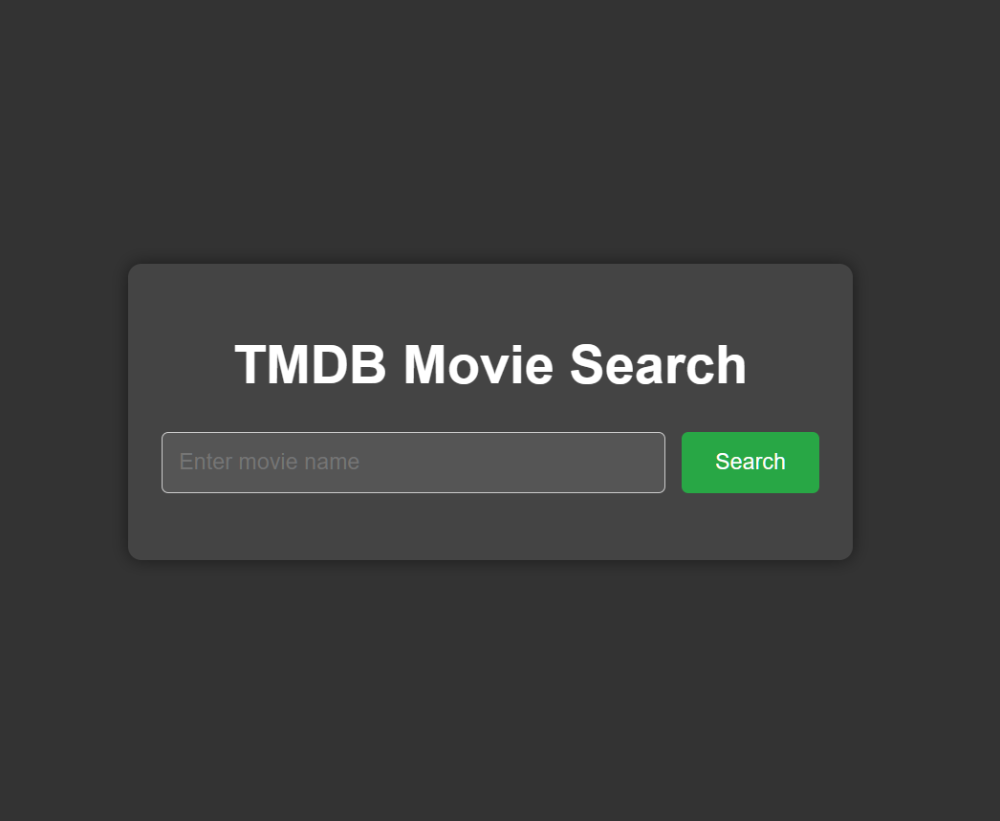

# TMDB Movie Search

Este é um projeto simples para buscar e exibir informações sobre filmes usando a API do TMDB.





## Funcionalidades

- Busca de filmes pelo nome.
- Exibição dos resultados com nome, ano, país, diretor e foto de capa.
- Paginação dos resultados.


## Tecnologias utilizadas

- Vite v5.3.1
- React v18.3.1
- Axios v1.7.2
- CSS 3


### Pré-requisitos

- Node.js (https://nodejs.org)
- npm (geralmente vem com o Node.js)


## Como executar o projeto

### Passos

1. Clone este repositório:

   ```bash
   git clone https://github.com/seu-usuario/tmdb-movie-search.git


2. Navegue até a pasta do projeto:

    cd tmdb-search


3. Instale as dependências do projeto:

    npm install


4. Adicione a sua chave de API do TMDB:

    Na linha 1 do arquivo App.jsx (localizado em tmdb-api/tmdb-search/src/App.jsx) você deve adicionar a sua chave da api como string na constante chamada token.
    Para obter uma chave da api (caso ainda não tenha) você deve começar por aqui: https://developer.themoviedb.org/docs/getting-started


5. Execute o projeto:

    npm run dev


6. Acesse o projeto em seu navegador:

    http://localhost:3000